<h1 align="center">cvpr-figure</h1>

<p align="center">
  <b>Publication-grade pipeline, framework and teaser figures for AI conference papers.</b><br>
  Write a short spec — get a figure that is <b>natively editable in Visio and PowerPoint</b>,
  plus PDF for LaTeX and 600 dpi PNG.
</p>

<p align="center">
  <a href="#quickstart">Quickstart</a> ·
  <a href="#install">Install</a> ·
  <a href="#the-template-gallery">Templates</a> ·
  <a href="#editing-the-output-visio-powerpoint-illustrator">Visio</a> ·
  <a href="#the-auditor">Auditor</a> ·
  <a href="README.zh-CN.md">中文文档</a>
</p>

<p align="center">
  <a href="https://github.com/ChizkiyahuOhayon/cvpr-figure/actions/workflows/test.yml"></a>
  
  
  
  
</p>

<p align="center">
  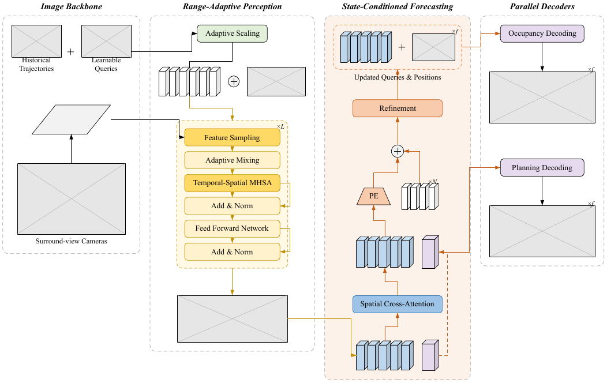
</p>

---

## Why this exists

Machine-made framework figures are not ugly. They are **generic**, and reviewers
recognise them in about a second:

| The tell | What a real conference figure does instead |
|---|---|
| Saturated rainbow fills, one hue per box | 3–5 pale tints, each meaning exactly one thing |
| Drop shadows, gradients, glassmorphism | Flat fills, one black hairline outline |
| Gears, brains, clouds, sparkles, emoji | Tensors as slabs, encoders as trapezoids |
| Whole sentences inside boxes | Noun phrases, six words or fewer |
| Identical boxes on a perfect grid | Widths that encode importance |
| Floating curved arrows that miss their ports | Orthogonal runs on port normals |
| No real data anywhere | Real input crops and real output renders, embedded |
| "Figure 1: Overview of the proposed framework." | A caption that states a claim |

Every one of those is a *default*. `cvpr-figure` removes them from the engine so
they cannot come back by accident:

- the palette, type sizes, stroke weights, corner radii and padding were
  **measured out of the vector content of published CVPR/ICCV/AAAI PDFs**, not
  invented (see [`references/house-style.md`](references/house-style.md));
- layout is solved deterministically **in final printed points** — `size: 7.0`
  in the spec is 7.0 pt on the printed page, with no mental arithmetic;
- arrows are *forced* to leave and enter along port normals and turn at right
  angles;
- an **auditor** must pass before you ship, and it names each tell individually.

### The finding that set the palette

Taking the SparseWorld, GaussianWorld, EmbodiedOcc, StreamVGGT and TPVFormer
figures apart with PyMuPDF: the fills are **exactly the Microsoft Office theme
tint ladder**, and the embedded font tables still carry `SimSun`, `SimHei` and
`Calibri`. Those figures were drawn in a Chinese-locale **PowerPoint**.

```
#92CDDC #B7DDE8 #DBEEF3   Office Accent5 at 40 / 60 / 80 % lighter
#FFD965 #FFE699 #FFF2CC   gold, same ladder
#ED7D31 #F8CBAD #FBE5D6   orange, same ladder
strokes: #000000 × 1191 occurrences, next colour × 20
```

So this project uses the colour chips the authors actually clicked, rather than
a "nicer" invented palette — which reads as foreign immediately — and treats
`.pptx` export as a first-class output rather than a convenience.

---

## Quickstart

No install, no dependencies. Clone and render:

```bash
git clone https://github.com/ChizkiyahuOhayon/cvpr-figure.git
cd cvpr-figure

python3 scripts/render.py examples/quickstart.yaml -o build/quickstart \
        -f svg,pdf,png,pptx,vsdx --dpi 600
```

```
wrote build/quickstart.svg
wrote build/quickstart.pdf
wrote build/quickstart.png
wrote build/quickstart.pptx
wrote build/quickstart.vsdx
  pdf via libreoffice
  png via pdftoppm @600 dpi -- 4147 x 1530 px
  pptx: 44 shapes, 0 embedded image(s)
  canvas 496.8 x 182.8 pt | 10 nodes | 8 edges | scale 1.000
```

<p align="center">
  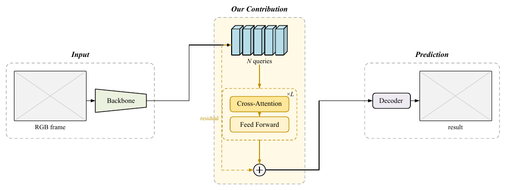
</p>

That came from [`examples/quickstart.yaml`](examples/quickstart.yaml), which is
about 50 lines. Open `build/quickstart.pptx` in PowerPoint or
`build/quickstart.vsdx` in Visio and drag a box: **everything is a native
shape**, no ungrouping required.

Then check it:

```bash
python3 scripts/validate.py examples/quickstart.yaml --svg build/quickstart.svg
# 0 error(s), 0 warning(s), 0 note(s) | 497 x 183 pt | 10 nodes
```

---

## Install

### As a Claude Code skill (recommended)

```bash
git clone https://github.com/ChizkiyahuOhayon/cvpr-figure.git
cd cvpr-figure
./install.sh              # -> ~/.claude/skills/cvpr-figure   (all projects)
./install.sh --project    # -> ./.claude/skills/cvpr-figure   (this repo only)
```

The installer copies the skill, runs a self-test, and reports which optional
converters it found. Then just ask, in plain language:

> Read `method.tex` and draw the overview figure for a CVPR submission,
> full width. Export a PDF for LaTeX and an editable `.vsdx`.

Claude Code loads [`SKILL.md`](SKILL.md), fills in the figure contract, picks an
archetype, writes the spec, renders, audits and hands back the LaTeX block.
You can also invoke it explicitly with `/cvpr-figure`.

### With Codex, Cursor, Aider, or a plain API loop

Point the agent at [`AGENTS.md`](AGENTS.md) — the same instructions without the
Claude Code routing metadata:

```bash
git clone https://github.com/ChizkiyahuOhayon/cvpr-figure.git third_party/cvpr-figure
# then, in your AGENTS.md / .cursorrules / system prompt:
#   "For any framework, pipeline, teaser or module figure,
#    follow third_party/cvpr-figure/AGENTS.md."
```

`agents/openai.yaml` carries the display name and default prompt for hosts that
read it.

### By hand, without an agent

The engine is a normal CLI. Copy the template closest to your figure, edit the
YAML, render. Everything in [`references/spec-language.md`](references/spec-language.md).

### Requirements

| | |
|---|---|
| **Required** | Python 3.8+. That is all — the engine is standard library only. |
| **Optional** | PyYAML (a bundled parser covers the same subset, byte-identically, when it is absent) |
| **For `.pdf`** | any one of Inkscape, LibreOffice, `rsvg-convert`, CairoSVG |
| **For `.png` / `.tiff`** | `pdftoppm` (poppler-utils) or ImageMagick |
| **For `.emf`** | Inkscape or LibreOffice |

`.svg`, `.vsdx` and `.pptx` are written by bundled code and **always** work.

<details>
<summary>Installing the optional converters</summary>

```bash
# macOS
brew install --cask inkscape libreoffice
brew install poppler imagemagick

# Debian / Ubuntu
sudo apt install inkscape libreoffice-draw poppler-utils imagemagick librsvg2-bin

# minimal: poppler + librsvg is enough for PDF and high-resolution PNG
```
</details>

---

## How it works

Three steps. The skill walks an agent through all three; by hand you do the same.

### 1. The figure contract — before drawing anything

[`static/core/contract.md`](static/core/contract.md) asks seven questions. The
first one does most of the work:

> This figure makes the reader believe: ______________________

If the sentence needs an "and", it is two figures. If it is *"this is the
architecture of our method"*, that is a description, not a claim, and it
produces a figure with nothing to emphasise.

You also fix the archetype, the one element that is the contribution, the
semantic colour map, the venue and column width, and which real crops will fill
the image slots.

### 2. The spec — semantics, not pixels

You state **what goes where in what order**. The engine decides geometry.

```yaml
figure: {id: overview, venue: cvpr, width: double, font: times}

layout: row
gap: 14

panels:
  - id: s_core
    title: "Our Contribution"          # bold italic, above a dashed container
    frame: dashed
    fill: gold.pale
    body:
      - {id: q, shape: slab, n: 5, cell: 8, cellh: 26, role: attention}
      - group:                          # a tinted sub-region with a repeat badge
          id: blk
          frame: region
          frame_color: gold.deep
          badge: "×L"
          body:
            - {id: b1, text: "Cross-Attention", role: core, outline: match}
            - {id: b2, text: "Feed Forward",    role: core, outline: match}

edges:
  - {from: q, to: blk, color: gold.deep}
  - {from: q.w, to: sum.w, route: bus, bend: 10, dash: true, label: "residual"}
```

Two properties do most of the "this looks hand-made" work:

- **uniform snapping** — box-shaped siblings in a column are snapped to the
  widest, and in a row to the tallest, so a stack of modules sits on a grid;
- **port-normal routing** — whatever route you ask for, the line leaves along
  the source port's normal and arrives along the target's, and turns at right
  angles. No arrowhead ever lands flat against an edge.

### 3. The audit — before you ship

```bash
python3 scripts/validate.py spec.yaml --svg build/fig.svg
```

Fix every `FAIL`. Justify or fix every `WARN`. Then do the eye pass in
[`references/anti-ai-checklist.md`](references/anti-ai-checklist.md): squint
test, trace one path with a finger, cover the caption, convert to greyscale.

---

## The template gallery

Copy the one closest to your figure and replace the content. Starting from a
blank spec wastes effort and loses the proportions that make an archetype work.

A paper usually needs **one teaser-class figure plus one or two others**.
Needing a third framework figure is almost always a sign that the method has
not been factored cleanly.

### Architecture papers — the contribution is a model

<table>
<tr>
<td width="50%"><a href="templates/pipeline-4stage.yaml"></a></td>
<td width="50%"><a href="templates/teaser-comparison.yaml">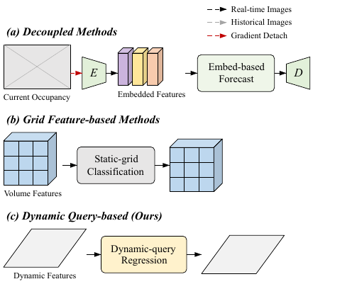</a></td>
</tr>
<tr>
<td><b><code>pipeline-4stage</code></b><br><i>"What are the moving parts?"</i><br>3–5 dashed stage containers, tinted wash on the contribution, per-stage arrow colour. Double column.</td>
<td><b><code>teaser-comparison</code></b><br><i>"Isn't this just X?"</i><br>Paradigm rows (a)(b)(c…Ours) sharing one colour vocabulary, so only the operator changes. Page 1, single column.</td>
</tr>
<tr>
<td><a href="templates/module-detail.yaml">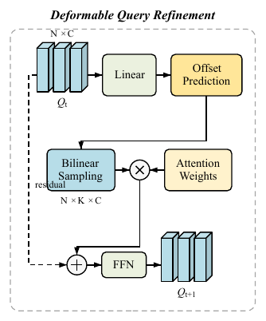</a></td>
<td><a href="templates/attention-tokens.yaml">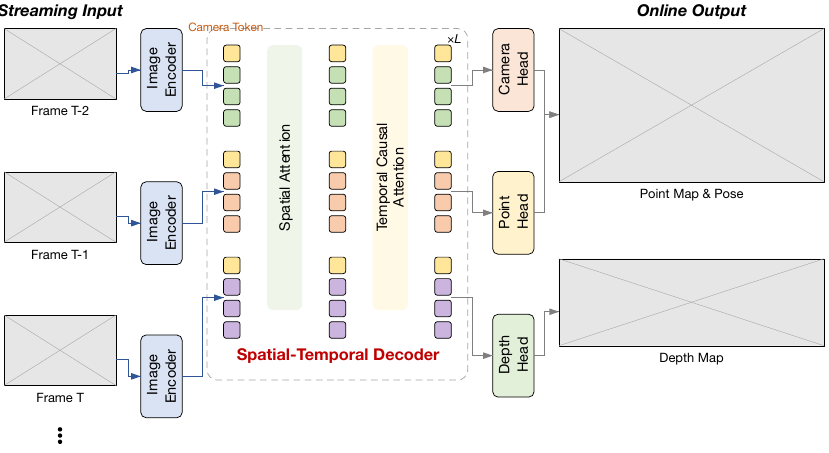</a></td>
</tr>
<tr>
<td><b><code>module-detail</code></b><br><i>"Does the maths match the wiring?"</i><br>One block expanded, operators explicit, tensor shapes annotated. Single column.</td>
<td><b><code>attention-tokens</code></b><br><i>"Why is this attention pattern better?"</i><br>Token banks coloured by provenance passing through pale attention regions. Double column.</td>
</tr>
<tr>
<td><a href="templates/streaming-worldmodel.yaml">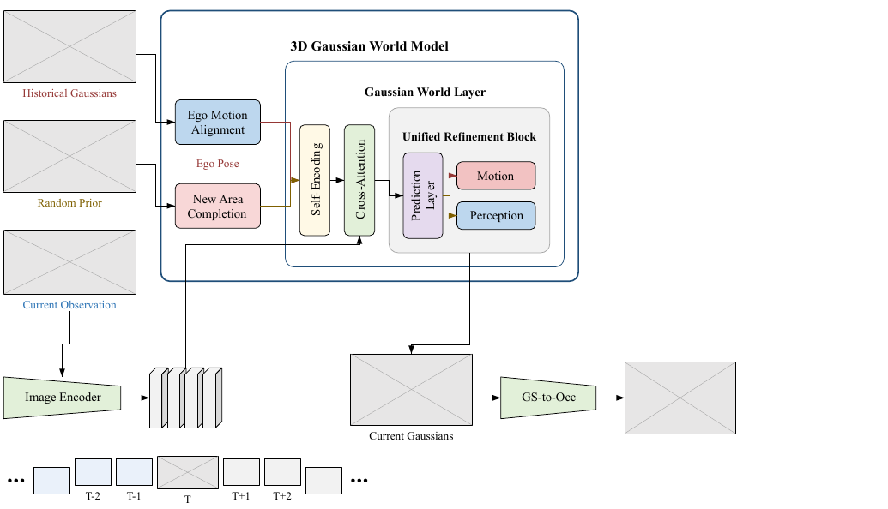</a></td>
<td><a href="templates/dual-branch.yaml">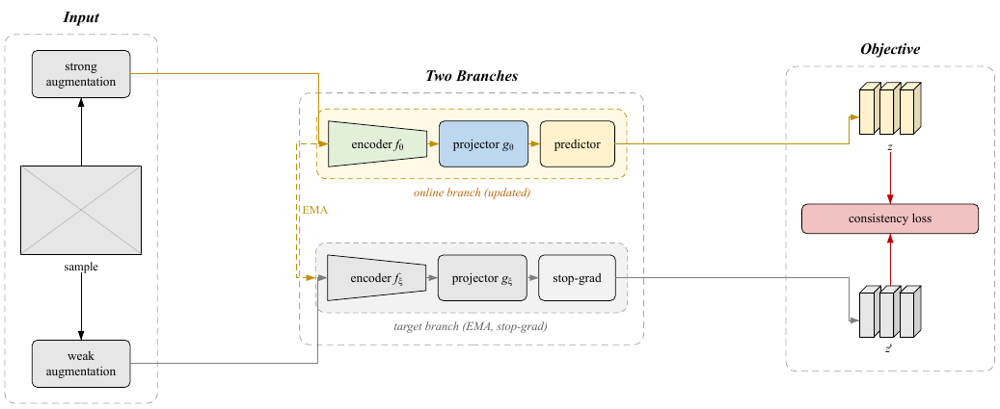</a></td>
</tr>
<tr>
<td><b><code>streaming-worldmodel</code></b><br><i>"What is remembered between steps?"</i><br>Nested containers plus a time rail; labels coloured to match their stream. Double column.</td>
<td><b><code>dual-branch</code></b><br><i>"How do the two branches relate?"</i><br>Teacher–student, contrastive, EMA. Parallel branches, dashed stop-grad link. Double column.</td>
</tr>
<tr>
<td colspan="2"><a href="templates/gated-module.yaml">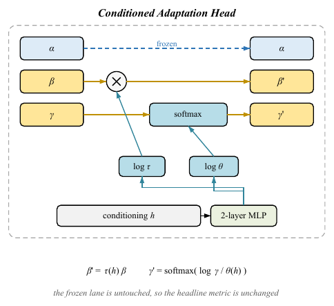</a>
<br><b><code>gated-module</code></b> — <i>"What did you change and what did you freeze?"</i><br>
Adapters, LoRA, FiLM, calibration heads. One frozen lane passes through; the others are modulated by gates. The operators are staggered horizontally so each gate rises straight into the one it drives and <b>no two arrows cross</b>. Single column.</td>
</tr>
</table>

### Analysis, evaluation and position papers — no network to draw

These exist because a measurement paper still has an argument, and the argument
is what the figure has to carry.

<table>
<tr>
<td width="50%"><a href="templates/blindspot-teaser.yaml">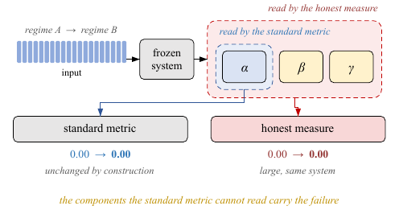</a></td>
<td width="50%"><a href="templates/factorial-2x2.yaml">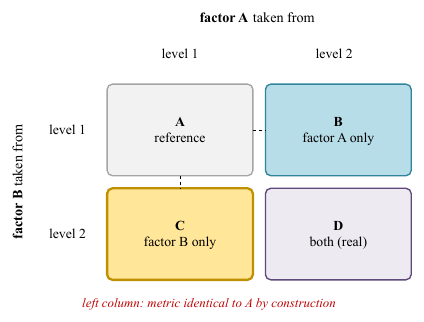</a></td>
</tr>
<tr>
<td><b><code>blindspot-teaser</code></b><br><i>"What can the standard metric not see?"</i><br>The subset relation is drawn as <b>nested regions</b>, so each evaluator needs exactly one arrow and nothing crosses. Page 1, single column.</td>
<td><b><code>factorial-2x2</code></b><br><i>"What did the controlled design isolate?"</i><br>Two factors crossed into four conditions; exactly one cell carries the claim. Single column.</td>
</tr>
<tr>
<td><a href="templates/study-overview.yaml">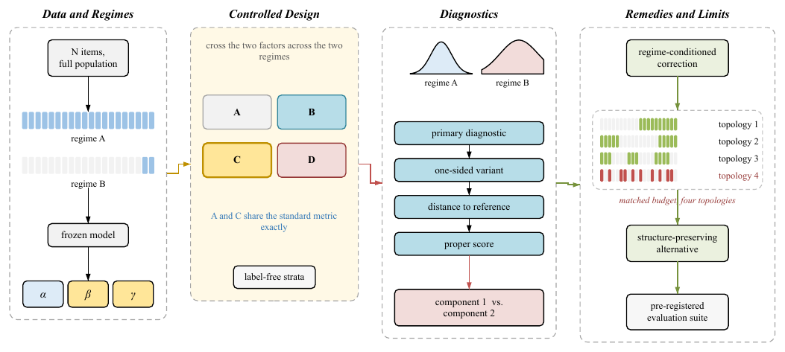</a></td>
<td><a href="templates/taxonomy.yaml">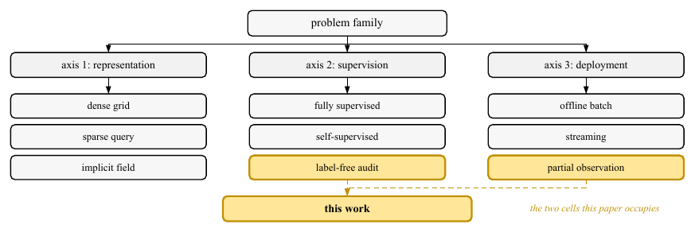</a></td>
</tr>
<tr>
<td><b><code>study-overview</code></b><br><i>"What is the shape of the study?"</i><br>Data and regimes → controlled design → diagnostics → remedies <i>and their limits</i>. Double column.</td>
<td><b><code>taxonomy</code></b><br><i>"Where does this sit in the field?"</i><br>A partition with only the occupied cells coloured. Intro / related work, double column.</td>
</tr>
</table>

Full rules for each, including the characteristic failure mode, are in
[`references/archetypes.md`](references/archetypes.md).

---

## Output formats

```bash
python3 scripts/render.py spec.yaml -o build/fig \
        -f svg,pdf,png,tiff,emf,vsdx,pptx --dpi 600
```

| Format | Written by | Editable as |
|---|---|---|
| `.svg` | bundled | Illustrator, Inkscape, Figma, Affinity, browsers |
| `.vsdx` | **bundled** | **Visio, natively — no ungroup step** |
| `.pptx` | **bundled** | **PowerPoint, natively; pastes into Visio as shapes** |
| `.pdf` | whichever converter is present | LaTeX `\includegraphics`, Illustrator |
| `.png` / `.tiff` | rasterised from the PDF at `--dpi` | slides, rebuttals, posters |
| `.emf` | Inkscape or LibreOffice | Word, and Visio import + ungroup |

### About resolution

Rasters are **always taken from the PDF**, never straight from the SVG.
LibreOffice's PNG filter silently ignores the requested density and emits a
96 dpi screenshot — a 600 dpi request used to produce a 317 px image. So
`render.py` rasterises the PDF with a tool that honours a density flag, then
**verifies the produced pixel count against `--dpi`** and warns if a converter
cut the corner:

```
png via pdftoppm @600 dpi -- 4200 x 1857 px
```

Use **600 dpi** for camera-ready and **1200 dpi** for a poster.

---

## Editing the output: Visio, PowerPoint, Illustrator

Every module in `build/fig.vsdx` is a **real Visio shape** with its own
geometry, fill, line and character sections:

- click a box and the Format Shape pane shows the fill as `#FFE699`;
- drag a vertex and the geometry updates — no ungroup;
- edit the text in place and it stays 7 pt Times New Roman;
- arrows are polylines with `EndArrow=4`, so their waypoints are draggable.

> **Raster panels.** `image` nodes export to `.vsdx` as labelled placeholder
> rectangles, and the render report lists the files it skipped. Use `.pptx` if
> you want the crops embedded for you, or drop them in by hand with
> *Insert → Pictures*.

### The module stencil

Prefer not to write YAML at all? Generate a drag-and-drop palette:

```bash
python3 scripts/make_stencil.py -o build/stencil -f vsdx,pptx
```

<p align="center">
  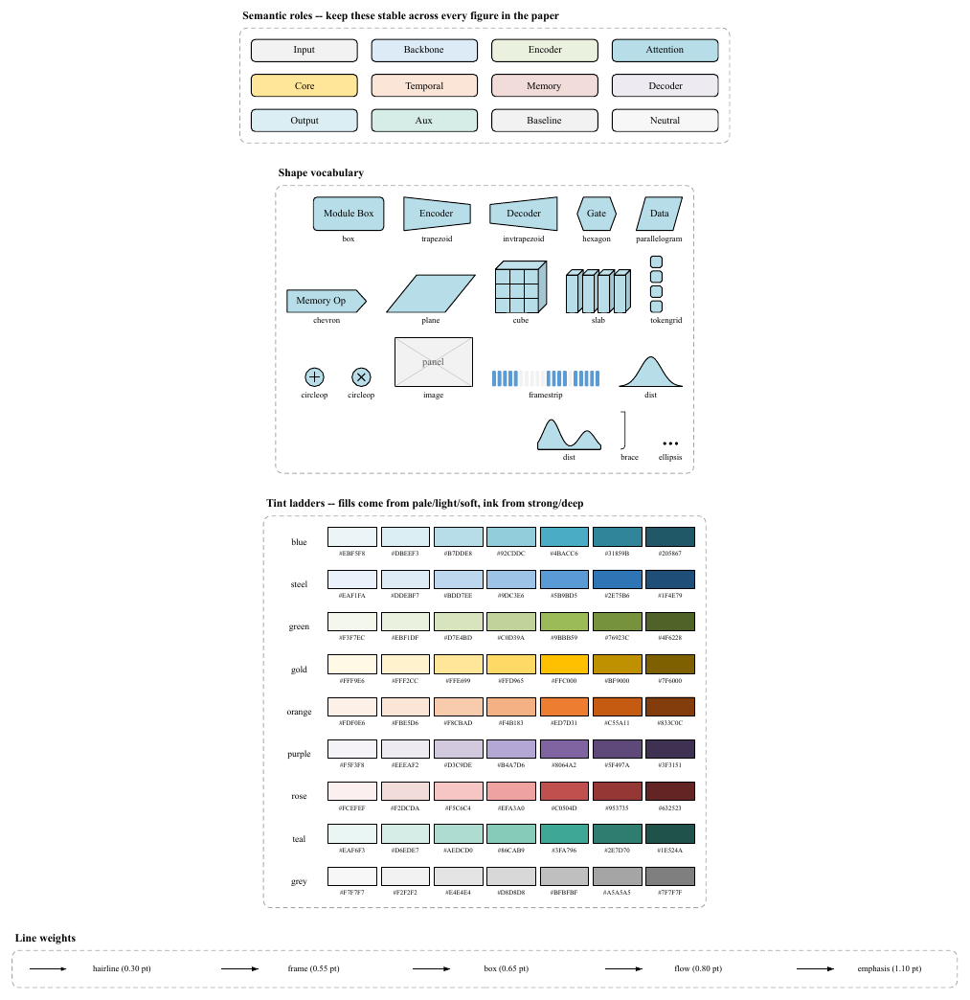
</p>

Keep it open in a second window and copy modules across. They arrive already
carrying the house fill, outline, corner radius and 7 pt Times label.

Full round-trip notes in [`references/visio-workflow.md`](references/visio-workflow.md).

---

## The auditor

```bash
python3 scripts/validate.py spec.yaml --svg build/fig.svg [--strict] [--json]
```

| Code | Level | What it catches |
|---|---|---|
| `text-too-small` | error | anything under 5.5 pt **at final printed size** |
| `label-overflow` | error | text wider than its box |
| `node-overlap` | error | two siblings occupying the same space |
| `inconsistent-role` | error | one concept drawn in two different fills |
| `bad-edge` | error | an edge naming a node that does not exist |
| `emoji` | error | emoji or dingbats |
| `edge-crosses-node` | warning | an arrow routed through a third module |
| `off-palette` | warning | a colour outside the house tint ladders |
| `too-many-hues` | warning | more than five colour families |
| `stroke-zoo` | warning | more than four distinct line weights |
| `mixed-fonts` | warning | two type families in one figure |
| `label-verbose` | warning | a label over six words |
| `tall-figure` | warning | over the venue's height budget |
| `gradient` / `shadow` | warning | gradients or filters in the SVG |
| `unconnected` | note | a module no arrow touches |

Exit code is non-zero on any error, or on any warning with `--strict` — so it
drops straight into CI or a pre-commit hook.

It is not decoration. On a real paper it caught four labels at 5.4 pt, a figure
using six colour families, and a template that drew `encoder` in two different
fills — all of which would otherwise have shipped.

The auditor cannot judge whether the figure *communicates*. Render a PNG and
look at it.

---

## Putting it in the paper

The engine lays out in **final rendered points**, and `venue` + `width` set the
canvas to the exact column width. So:

```latex
\begin{figure*}[t]
  \centering
  \includegraphics[width=\linewidth]{figures/overview.pdf}
  \caption{\textbf{Overview of X.} <the claim>. <the parts, left to right>.}
  \label{fig:overview}
\end{figure*}
```

renders at 100 %, and `size: 7.0` in the spec is 7.0 pt on the page.

Want it at 80 % of the column? Set `width_frac: 0.8` **in the spec** and keep
`width=\linewidth` in LaTeX. Writing `width=0.8\linewidth` instead shrinks your
type to 5.6 pt.

| Venue | `\columnwidth` | `\textwidth` |
|---|---|---|
| CVPR / ICCV / WACV | 237.13 pt | 496.85 pt |
| ECCV (LNCS) | 347.12 pt | 347.12 pt |
| NeurIPS / ICLR | 397.48 pt | 397.48 pt |
| ICML | 234.88 pt | 487.82 pt |
| AAAI | 238.49 pt | 504.00 pt |
| ACL / EMNLP | 219.08 pt | 455.24 pt |

More, including float placement and camera-ready checks, in
[`references/latex-integration.md`](references/latex-integration.md).

### Keeping figures reproducible

```
figures/
  overview.pdf          <- what LaTeX includes
  overview.pptx         <- what you hand a co-author
  src/overview.yaml     <- the spec, committed
  src/crops/*.png       <- the real data panels
```

```bash
for f in figures/src/*.yaml; do
  python3 scripts/render.py "$f" -o "figures/$(basename "${f%.yaml}")" \
          -f svg,pdf,pptx --dpi 600
done
```

---

## Repository layout

```
SKILL.md                  Claude Code entry point (frontmatter routing)
AGENTS.md                 Codex / other-agent entry point
manifest.yaml             which fragment to load for which job
install.sh                one-command install as a Claude Code skill

static/core/
  stance.md               the non-negotiables and the list of tells
  contract.md             the seven questions to answer before drawing

references/
  house-style.md          the measured palette, type and strokes — and the method
  spec-language.md        the full spec grammar
  archetypes.md           eleven archetypes and what makes each one work
  case-studies.md         five published figures taken apart
  anti-ai-checklist.md    the automated checks plus the eye pass
  visio-workflow.md       Visio / PowerPoint / Illustrator editing
  latex-integration.md    sizing, floats, camera-ready checks

scripts/
  render.py               spec -> svg / pdf / png / tiff / emf / vsdx / pptx
  validate.py             the auditor
  make_stencil.py         the module palette generator
  cvprfig/                the engine (standard library only)
    style.py              palette, typography, strokes, geometry constants
    text.py               baked Adobe Core-14 metrics + inline markup
    layout.py             the box-model solver
    edges.py              orthogonal routing
    shapes.py             the shape vocabulary
    svg.py vsdx.py pptx.py   three renderers over one layout
    miniyaml.py           dependency-free YAML subset parser

templates/                eleven archetypes + stencil.vsdx / stencil.pptx
examples/quickstart.yaml  the 50-line example above
assets/gallery/           rendered previews
tests/test_engine.py      105 regression checks
```

---

## Tests

```bash
python3 tests/test_engine.py
```

105 checks, no dependencies, about two seconds. They cover text metrics against a
published box width, the bundled YAML parser (byte-identical output to PyYAML),
layout snapping, port-normal routing, colour and named-stroke resolution, nested
container forms, every shape, all eleven templates rendering *and passing the
auditor*, `.vsdx` / `.pptx` package structure and shape counts, and the
auditor's own positive and negative cases.

CI runs them on Python 3.9, 3.11 and 3.13 with **nothing installed**, so a
regression that introduces a dependency fails the build.

---

## FAQ

<details>
<summary><b>Can it draw bar charts, curves, heatmaps or ablation plots?</b></summary>

No, and it will tell you so. Those are matplotlib/seaborn work. This project is
for the figures matplotlib is bad at: architecture diagrams, pipelines, teasers,
module zoom-ins, taxonomies.
</details>

<details>
<summary><b>Does it use an image model?</b></summary>

No. Nothing is generated by diffusion or by an LLM drawing SVG coordinates —
both produce exactly the generic look this project exists to prevent. A
deterministic solver computes every coordinate, so the same spec always gives
the same figure, and a diff of the spec is a diff of the figure.
</details>

<details>
<summary><b>Will it invent my results?</b></summary>

No. `image` nodes without a `src` render as **deliberately obvious** labelled
placeholders, so an unfinished figure cannot be mistaken for a finished one, and
the render report lists which slots are still empty.
</details>

<details>
<summary><b>My figure is too wide. What now?</b></summary>

The renderer scales it down and tells you the *effective* point size:

```
WARNING: Layout is 539.6 pt wide but the target column is 504.0 pt,
         so the figure is scaled to 93%; body labels render at ~6.5 pt.
```

Below 5.5 pt that becomes an error. The fix is to shorten labels, drop a stage,
or split the figure — not to accept the shrink.
</details>

<details>
<summary><b>Can I edit the <code>.vsdx</code> and get the spec back?</b></summary>

No — there is no reverse parser. Treat the spec as the master while the
structure is still moving, and switch to editing the `.vsdx` or `.pptx` only
once the layout has settled.
</details>

<details>
<summary><b>Fonts look wrong after conversion.</b></summary>

The SVG names `Times New Roman, Nimbus Roman, Liberation Serif, Times, serif` so
it degrades sensibly, but converters substitute at their own discretion. Check
with `pdffonts build/fig.pdf`; for exact metrics convert with Inkscape and
`--export-text-to-path`.
</details>

<details>
<summary><b>How do I match a specific paper's style?</b></summary>

Read its palette straight out of the published PDF — the method is at the top of
[`references/house-style.md`](references/house-style.md) — then write a spec
with those colours. [`references/case-studies.md`](references/case-studies.md)
takes five well-known figures apart idiom by idiom.
</details>

<details>
<summary><b>Two things share a name but must be different colours.</b></summary>

Usually the right fix is to name them apart — real dual-branch figures write
`encoder f_θ` and `encoder f_ξ`, not `encoder` twice. When the contrast really is
the point, set `same_label_ok: true` on the node to silence that one check.
</details>

---

## Reference corpus and attribution

The style constants were measured from the vector content of these published
papers' PDFs. Only typographic parameters were extracted — palette, type sizes,
stroke weights, geometry. **No graphical content was copied**, and everything in
`assets/gallery/` was rendered by this project's own templates.

| Paper | Venue |
|---|---|
| SparseWorld: A Flexible, Adaptive and Efficient 4D Occupancy World Model | arXiv:2510.17482 |
| GaussianWorld: Gaussian World Model for Streaming 3D Occupancy Prediction | CVPR 2025, arXiv:2412.10373 |
| EmbodiedOcc: Embodied 3D Occupancy Prediction | arXiv:2412.04380 |
| StreamVGGT: Streaming Visual Geometry Transformer | arXiv:2507.11539 |
| TPVFormer: Tri-Perspective View for 3D Semantic Occupancy Prediction | CVPR 2023, arXiv:2302.07817 |

The measurement method and the full numbers are in
[`references/house-style.md`](references/house-style.md), so you can repeat it on
any paper whose figures you admire.

---

## Contributing

Issues and pull requests are welcome. Please make sure
`python3 tests/test_engine.py` passes and that any new template renders with
**zero auditor errors** — CI checks both.

Especially useful:

- **new archetypes** for fields this does not cover yet (NLP, speech, RL,
  theory, robotics systems);
- **venue widths** verified against a real `\the\columnwidth`;
- **house-style measurements** from other labs' figures.

## Licence

[MIT](LICENSE) © 2026 Zhao Liu.

Free to use in your papers, commercially, and to redistribute. No attribution
required beyond the licence notice — though a star, or a mention if the figures
helped, is always appreciated.
